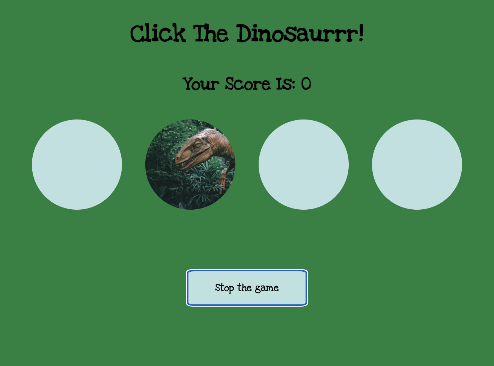

# SPEEDGAME: CLICK THE DINOSAUR ####

## Description

This is school project in which a first game was made and practiced implementing:
- classList / add() & remove()
- setTimeout
- Math.random()
- Modal display/hide
- Sounds

## Technologies
- HTML
- CSS
- JavaScript

## Instructions

1. You have 10 rounds to click the dinosaur showing in one of the four circles in your screen in a randomized way.
2. Try to click the dinosaur as many times as possible , aim at a perfect score of 1000 points (each click is worth 100 points).
3. Watch out! The pace increases every time you hit the dinosaur.
4. Good luck!

## Live Page

Play it [here](https://public.bc.fi/s2300106/speedgame/)

